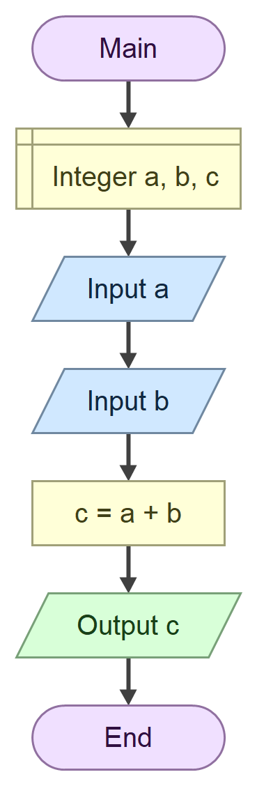

# Домаћи задатак

## Задатак

*Искоментарисати* код **програма** из фајла `Program.cs`.

``` cs
using System;

namespace ConsoleApp
{
    internal class Program
    {
        static void Main(string[] args)
        {
            int a, b, c;
            Console.Write("Unesi A: ");
            a = int.Parse(Console.ReadLine());
            Console.Write("Unesi B: ");
            b = int.Parse(Console.ReadLine());
            c = a + b;
            Console.WriteLine("Zbir A i B je: " + c);
        }
    }
}
```

## Променљиве у програму

| Променљива | Тип   | Вредност      | Пример |
| ---------- | ----- | ------------- | ------ |
| `a`        | `int` | Уноси се      | `2`    |
| `a`        | `int` | Уноси се      | `3`    |
| `a`        | `int` | Израчунава се | `5`    |

## Алгоритамска шема



